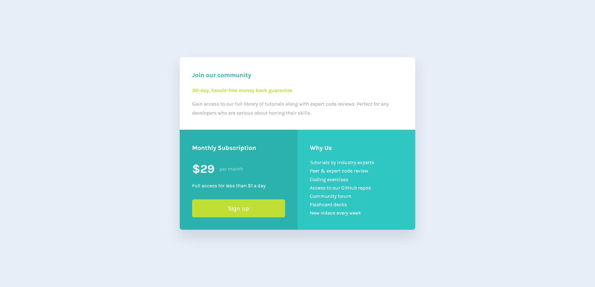

# Frontend Mentor - Single Price Grid Component Solution

This is a solution to the [Single price grid component challenge on Frontend Mentor](https://www.frontendmentor.io/challenges/single-price-grid-component-5ce41129d0ff452fec5abbbc).

## Table of contents

- [Overview](#overview)
  - [The challenge](#the-challenge)
  - [Screenshot](#screenshot)
  - [Links](#links)
- [My process](#my-process)
  - [Built with](#built-with)
  - [What I learned](#what-i-learned)
  - [Continued development](#continued-development)
- [Author](#author)

## Overview

### The challenge

Users should be able to:

- View the optimal layout for the component depending on their device's screen size.
- See a hover state on desktop for the Sign Up call-to-action.

### Screenshot

### Links

- Solution URL: [GitHub](https://github.com/wesleyjacoby/Single-Price-Grid-Component)
- Live Site URL: [GitHub Pages](https://wesleyjacoby.github.io/Single-Price-Grid-Component/)

## My process

### Built with

- Semantic HTML5 markup
- CSS custom properties
- CSS Grid

### What I learned

I still find myself trying to get comfortable with CSS Grid, especially when it comes to `grid-template-areas` and `grid-area` and the need to explicidly declare the columns and rows.

### Continued development

I will continue to try do more challenges that use CSS Grid so as to get more comfortable with it.

## Author

- Frontend Mentor - [@wesleyjacoby](https://www.frontendmentor.io/profile/wesleyjacoby)